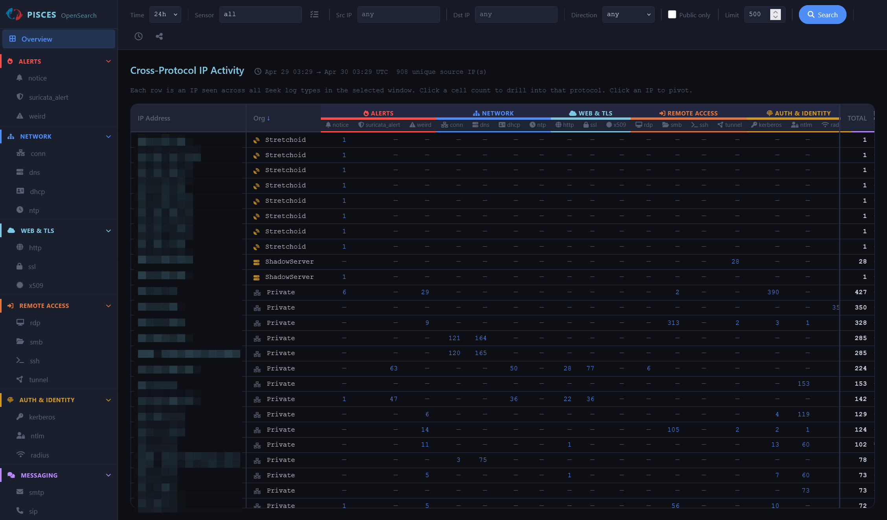
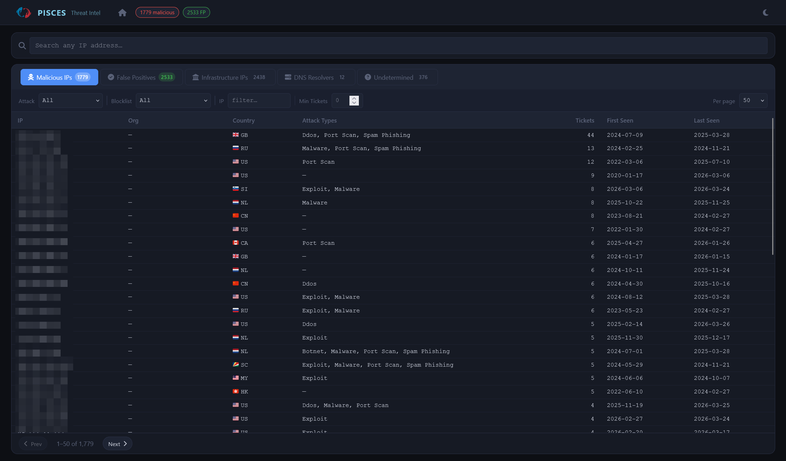
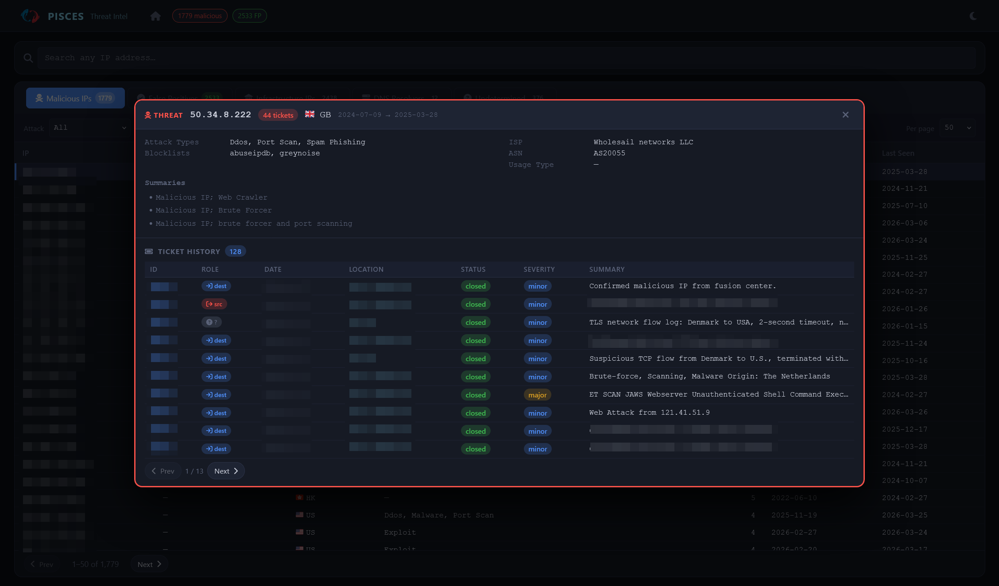
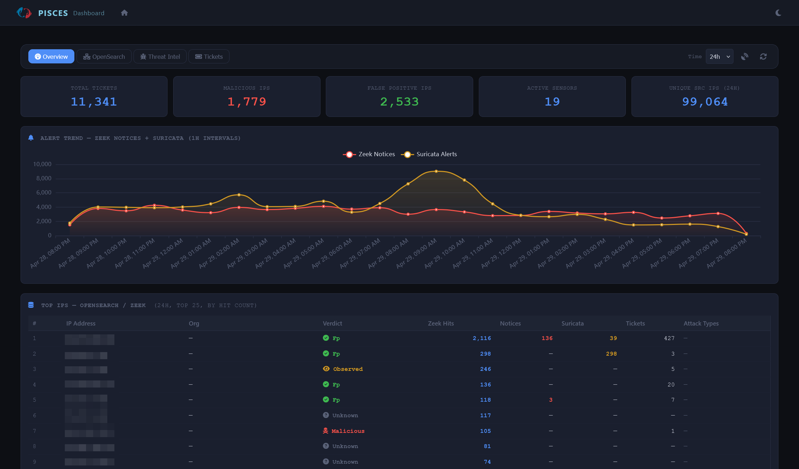

# PISCES SOC Analyst Toolkit

A browser-based and command-line toolkit for querying and triaging network traffic from the PISCES sensor network. Search across all protocol logs, look up threat intelligence on suspicious IPs, manage false positives, and link findings to Mantis tickets — all from one place.

[About the PISCES program](https://pisces-intl.org/about-pisces/) · [pisces-intl.org](https://pisces-intl.org)

**New here?** Start with the [Getting Started guide](docs/getting-started.md).

---

## What you can do with it

- **See the full picture for any IP** — one view shows how many times an address appeared across connection, DNS, web, email, and all other log types simultaneously
- **Look up suspicious IPs instantly** — GreyNoise, AbuseIPDB, Shodan, and VirusTotal results in one panel, with direct links for manual review
- **Suppress noise without restarting** — mark a known scanner or benign host as a false positive and it disappears from results on the next search
- **Search the PISCES ticket history inline** — look up existing tickets on any IP without leaving the tool
- **Run focused queries from the terminal** — filter by sensor, time range, source IP, or protocol when you need more control than the web UI offers

---

## Web UI

Four browser-based apps served from a central hub. Launch everything with one command and open your browser — no configuration beyond credentials required.

**OpenSearch** — cross-protocol IP activity matrix showing hit counts across all log types, with per-protocol drill-down and inline enrichment.

**Threat Model** — threat modelling dashboard with disposition scoring and known malicious IP tracking.

**Dashboard** — aggregated analytics dashboard.

| App | What it's for |
|---|---|
| **OpenSearch** | Cross-protocol IP activity matrix, per-protocol drill-down, inline enrichment |
| **Threat Model** | Threat modelling dashboard with disposition scoring and known malicious IP tracking |
| **Dashboard** | Aggregated analytics dashboard |
| **Mantis Explorer** | Ticket browser and search across the PISCES ticket history |

---

## Documentation

**Setup**

| Guide | Description |
|---|---|
| [VM Setup](docs/vm-setup.md) | Create an Ubuntu VM and connect to the cyber range network |
| [Getting Started](docs/getting-started.md) | Install, configure, and launch the toolkit on Ubuntu |
| [MCP Getting Started](docs/getting-started-mcp.md) | Connect Claude Code, kiro-cli, or another AI assistant to the PISCES backends |

**Using the toolkit**

| Guide | Description |
|---|---|
| [Web UI Workflow](docs/workflow.md) | End-to-end triage walkthrough using the browser-based UI |
| [CLI Workflow](docs/cli-workflow.md) | Terminal-based querier walkthrough — alerts, enrichment, filters, tickets |
| [False Positive Filters](docs/filter-schema.md) | Filter file format, clause types, and manual authoring guide |
| [Mantis Integration](docs/mantis.md) | Ticket indexing and search reference |
| [Threat Model Generator](docs/mantis-threat-model.md) | Building and maintaining the IP registries that power the Mantis web app |

**Reference**

| Guide | Description |
|---|---|
| [Advanced Usage](docs/advanced-usage.md) | Full CLI flag reference for all tools |
| [MCP Server Reference](docs/mcp-servers.md) | Full tool reference for all three MCP servers |
| [Project Structure](docs/project-structure.md) | Annotated source tree |

---

## Contributing and security

See [CONTRIBUTING.md](CONTRIBUTING.md) for development guidelines and how to open a pull request.

To report a vulnerability, follow the process in [SECURITY.md](SECURITY.md).

Release notes for each version are recorded in [CHANGELOG.md](CHANGELOG.md).

---

## Development Transparency — Use of AI Tooling

This project was created with the assistance of AI coding tools. AI was used to generate initial code implementations and draft documentation. All AI-generated content has been reviewed and tested by a human.

---

## License

See [LICENSE](LICENSE) for details.

---

Maintained by [Liam Dale](https://github.com/liamadale)
