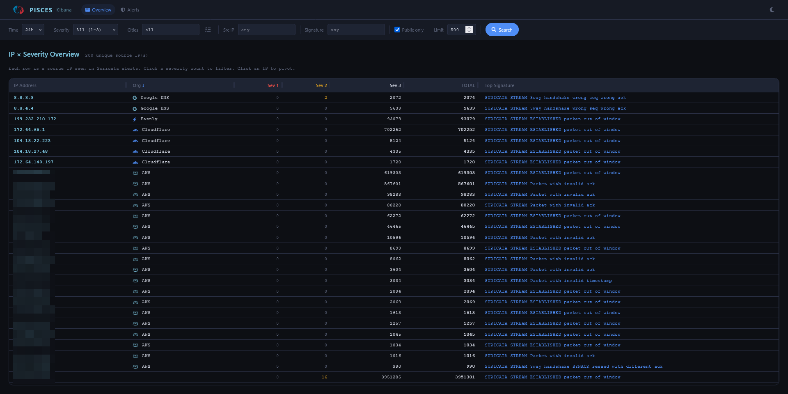
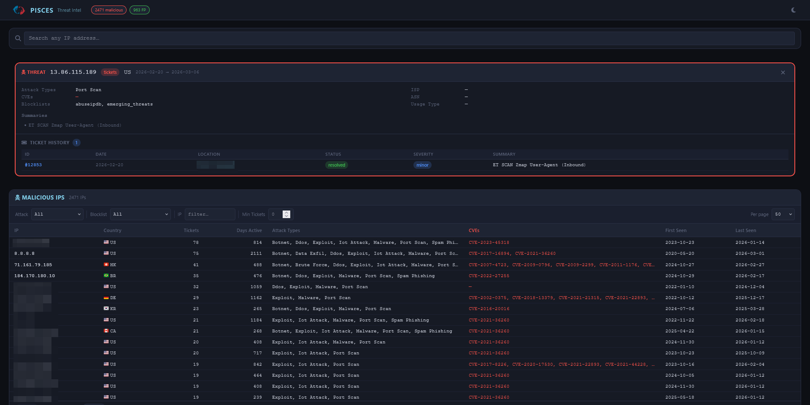

# PISCES SOC Analyst Toolkit

A Python-based security operations toolkit for querying, filtering, enriching, and triaging network log data from the PISCES program dataset. Targets two backends: a **Kibana/Suricata** alert feed and a **Malcolm/Zeek** OpenSearch instance. Built to reduce false positive noise through analyst-maintained YAML filters and structured threat intelligence enrichment.

## Overview

The toolkit surfaces actionable threats from high-volume log data by combining:

- **Pre-query filtering** via YAML-defined Elasticsearch DSL `must_not` clauses, reloaded on every search
- **Threat intelligence enrichment** through GreyNoise, AbuseIPDB, Shodan, and VirusTotal
- **IP organisation identification** — CDN, cloud provider, and known scanner recognition (Shodan, Censys, Stretchoid, etc.) with automatic range updates
- **Interactive false positive management** for rapid filter creation with comment support
- **Mantis ticketing integration** for incident tracking and submission

## Development Transparency - Use of AI Tooling

This project was created with the assistance of AI coding tools. AI was used to:
- Generate initial code implementations
- Draft documentation and usage examples

All AI-generated content has been reviewed and tested by a human.

## Features

### 1. Malcolm/Zeek OpenSearch Querier (`src/querier/opensearch_querier.py`)
Query Zeek protocol logs from Malcolm's OpenSearch instance across 10 log types: `conn`, `dns`, `http`, `ssl`, `smtp`, `rdp`, `smb`, `ssh`, `notice`, and `weird`. Per-protocol modules handle field parsing, deduplication, and display. Shared interactive loop supports enrichment, FP filter creation, Mantis search, and ticket submission from any log type.

### 2. Kibana Alert Querier (`src/querier/kibana_querier.py`)
Query Suricata IDS alerts from Kibana with flexible time range, severity, city, signature, and protocol filters. Deduplicates by `(src_ip, signature)` and displays a Rich terminal table. Interactive loop supports the same enrichment/FP/ticket actions.

### 3. False Positive Filter Management (`src/querier/fp_manager.py`)
Create YAML filters interactively from alert context, seeded with IP, signature, and sensor. Optional comment field auto-suggested from GreyNoise enrichment results. Filters take effect on the next `[r]`e-search without restarting the tool. See [docs/filter-schema.md](docs/filter-schema.md) for the full schema and authoring guide.

### 4. Threat Intelligence Enrichment (`src/enricher/threat_intel.py`)
Pipeline runs in order for each IP:
1. **GreyNoise** — classification (benign/malicious/unknown), name, reason; if benign, offer FP filter and stop
2. **AbuseIPDB** — confidence score, report count, ISP, domain, usage type
3. **Shodan** — open ports, OS, org, hostnames, known CVEs
4. **VirusTotal** — vendor detection count breakdown, ASN, country
5. **Reference URLs** — links to all four services always printed at the end

### 5. Mantis Integration (`src/mantis/`)
Search existing tickets via offline index or live web scraping. Interactive ticket creation and submission pre-seeded from alert data.

### 6. Web UIs (`apps/`)
Five browser-based Flask + HTMX applications served together through a central hub portal. Start everything at once with `run_all.py` (recommended), or run each app standalone on its own port.

| App | Path (combined) | Standalone launcher | Standalone port | Purpose |
|---|---|---|---|---|
| **Hub** | `/` | — | 5000 | Landing page with links to all apps |
| **OpenSearch** | `/opensearch` | `opensearch_web_run.py` | 5001 | Cross-protocol Zeek IP activity matrix, per-protocol drill-down, inline enrichment |
| **Kibana** | `/kibana` | `kibana_web_run.py` | 5002 | Suricata alert overview by IP × severity, signature frequency, city breakdown |
| **Mantis** | `/mantis` | `mantis_web_run.py` | 5003 | Ticket browser and threat modelling dashboard |
| **Dashboard** | `/dashboard` | `dashboard_web_run.py` | 5004 | Aggregated analytics dashboard across all three data sources |

The OpenSearch app's overview page shows how many times each source IP appears across all 10 Zeek log types simultaneously — a cross-protocol correlation not achievable in the CLI.

**OpenSearch Web UI** — cross-protocol IP activity matrix showing hit counts across all 10 Zeek log types, with per-protocol drill-down and inline enrichment.


**Kibana Web UI** — Suricata alert overview filtered by city/sensor, with signature frequency analysis, IP pivoting, and Mantis ticket lookup.



**Mantis Web UI** — ticket browser with threat modelling dashboard, disposition scoring, and known malicious IP tracking.



**Dashboard Web UI** — aggregated analytics across all three data sources in one view. Four tabbed sections:
- **Overview** — stat row (tickets, malicious/FP IPs, active sensors, Kibana alerts) and IP verdict distribution donut
- **OpenSearch** — protocol breakdown, sensor activity, top source IPs; plus a "Malcolm Dashboards" sub-tab with protocol-specific Zeek charts (DNS query types/domains/rcodes, HTTP methods/status codes/hosts/user agents, SSL/TLS versions/ciphers/SNI/validation, connection states/ports/bytes)
- **Kibana** — alert severity donut, city distribution, top Suricata signatures
- **Threat Intel** — attack type distribution, blocklist sources, monthly ticket timeline, top threat IPs table

All sections are lazy-loaded via HTMX on first tab activation and cached server-side (configurable TTL via `PISCES_DASHBOARD_CACHE_TTL`).

## Installation

This project uses [uv](https://github.com/astral-sh/uv) for dependency management. Install it first if you haven't:

```bash
curl -LsSf https://astral.sh/uv/install.sh | sh
```

Then:

```bash
git clone <repository-url>
cd pisces-scripts
uv sync
cp .env.example .env  # edit with your credentials
```

Run scripts with `uv run <script>` — no manual venv activation needed.

### Optional features

The core install covers the CLI queriers, web UIs, and enrichment pipeline. Additional features are opt-in:

| Extra | What it enables | Install |
|---|---|---|
| `mcp` | MCP servers for AI assistant integration (Claude Code, Claude Desktop) | `uv sync --extra mcp` |
| `ml` | ML-based ticket classifier in `mantis_index.py --use-ml` | `uv sync --extra ml` |
| `all` | Everything above | `uv sync --extra all` |

For example, to enable MCP servers and the ML classifier:

```bash
uv sync --extra mcp --extra ml
```

<details>
<summary>Alternative: plain venv + pip</summary>

```bash
python3 -m venv .venv && source .venv/bin/activate
pip install -r requirements.txt

# Optional features — install any combination:
pip install -r mcp/requirements.txt                          # MCP servers
pip install -r src/mantis/ticket_enrichment/requirements.txt # ML classifier
```
</details>

## Configuration

```bash
# OpenSearch / Malcolm (opensearch_querier.py, opensearch web UI, MCP opensearch server)
PISCES_USERNAME=
PISCES_PASSWORD=
OPENSEARCH_URL=      # base URL only — /api/console/proxy is appended automatically

# Kibana / Suricata (kibana_querier.py, kibana web UI, MCP kibana server)
KIBANA_URL=          # base URL only — /api/console/proxy is appended automatically

# Threat intelligence enrichment (all optional — missing keys skip that service)
GREYNOISE_API_KEY=
ABUSEIPDB_API_KEY=
SHODAN_API_KEY=
VIRUSTOTAL_API_KEY=

# Mantis ticketing
MANTIS_API_URL=
MANTIS_API_TOKEN=
```

## Usage

### Query Malcolm/Zeek Logs (OpenSearch)

```bash
# List available log types present in the index
.venv/bin/python src/querier/opensearch_querier.py --list-log-types

# Query conn logs (last 24 hours, public IPs only)
.venv/bin/python src/querier/opensearch_querier.py --log-type conn --public-only

# Query DNS with a specific query string filter
.venv/bin/python src/querier/opensearch_querier.py --log-type dns --dns-query malware.example.com

# Narrow to a specific sensor and time window
.venv/bin/python src/querier/opensearch_querier.py --log-type http --sensor hedgehog-1 --time-range now-6h
```

### Query Kibana Alerts (Suricata)

```bash
# Basic query (last 24 hours, all severities)
.venv/bin/python src/querier/kibana_querier.py

# Custom time range and severity
.venv/bin/python src/querier/kibana_querier.py --time-range now-7d --severity 2

# Filter to a specific signature pattern
.venv/bin/python src/querier/kibana_querier.py --signature "ET SCAN" --public-only
```

### Web UIs

The recommended way to run all apps is through `run_all.py`, which mounts them together under a single port via a hub portal:

```bash
# Combined — hub at http://0.0.0.0:5000 with all apps mounted beneath it
.venv/bin/python run_all.py

# Debug mode
.venv/bin/python run_all.py --debug

# Custom host/port
.venv/bin/python run_all.py --host 127.0.0.1 --port 8080
```

Each app can also run standalone on its own port (useful for development or if you only need one):

```bash
# OpenSearch — Zeek cross-protocol matrix (http://0.0.0.0:5001)
.venv/bin/python opensearch_web_run.py

# Kibana — Suricata alert overview (http://0.0.0.0:5002)
.venv/bin/python kibana_web_run.py

# Mantis — ticket browser (http://0.0.0.0:5003)
.venv/bin/python mantis_web_run.py

# Dashboard — aggregated analytics (http://0.0.0.0:5004)
.venv/bin/python dashboard_web_run.py

# All standalone launchers accept --host, --port, and --debug flags
.venv/bin/python opensearch_web_run.py --debug --port 5001
```

### Standalone Enrichment

```bash
# Full pipeline
.venv/bin/python src/enricher/threat_intel.py --ip 185.220.101.45

# Print reference URLs only (no API calls)
.venv/bin/python src/enricher/threat_intel.py --ip 185.220.101.45 --urls-only
```

### Manage False Positive Filters

```bash
# Interactive filter creator
.venv/bin/python src/querier/fp_manager.py

# List all filters
.venv/bin/python src/querier/fp_manager.py --list

# Validate all filter files
.venv/bin/python src/querier/fp_manager.py --validate
```

## MCP Servers (AI Assistant Integration)

Three MCP servers expose the same backends to AI coding assistants (Claude Code, Claude Desktop, kiro-cli):

| Server | Path | Tools |
|---|---|---|
| `opensearch` | `mcp/opensearch/` | 16 — Zeek logs, Suricata alerts, pivot tools, utilities |
| `kibana` | `mcp/kibana/` | 4 — Suricata alerts with full filter surface + aggregations |
| `mantis` | `mcp/mantis/` | 4 — MantisBT ticket search and creation |
| `enrichment` | `mcp/enrichment/` | 2 — IP threat intelligence and org lookup, no backend required |

See [docs/mcp-servers.md](docs/mcp-servers.md) for setup instructions, client configuration, and full tool reference.

## Workflow

See [docs/workflow.md](docs/workflow.md) for a full end-to-end walkthrough including triage patterns, mid-session filter creation, and prompt navigation.

## Project Structure

See [docs/project-structure.md](docs/project-structure.md) for the full annotated tree.

```
pisces-scripts/
├── run_all.py                # Combined launcher — all apps on one port (recommended)
├── opensearch_web_run.py     # Standalone OpenSearch web UI launcher → apps/opensearch_web/
├── kibana_web_run.py         # Standalone Kibana web UI launcher → apps/kibana_web/
├── mantis_web_run.py         # Standalone Mantis web UI launcher → apps/mantis_web/
├── dashboard_web_run.py      # Standalone Dashboard launcher → apps/dashboard_web/
├── apps/
│   ├── hub/                  # Hub portal (landing page, links to all apps)
│   ├── opensearch_web/       # Flask + HTMX Zeek/OpenSearch UI (port 5001 standalone)
│   ├── kibana_web/           # Flask + HTMX Suricata/Kibana UI (port 5002 standalone)
│   ├── mantis_web/           # Flask ticket browser (port 5003 standalone)
│   └── dashboard_web/        # Flask + HTMX aggregated analytics dashboard (port 5004 standalone)
│       ├── overview/         # Cross-source stat row + verdict donut
│       ├── opensearch/       # Protocol/sensor/IP charts + per-protocol Zeek panels
│       ├── kibana/           # Severity, signatures, city charts
│       └── mantis/           # Attack types, blocklists, timeline, top IPs
├── src/
│   ├── querier/            # OpenSearch and Kibana queriers, filter management
│   │   └── zeek_modules/   # Per-protocol Zeek log modules (conn, dns, http, …)
│   ├── enricher/           # GreyNoise, AbuseIPDB, Shodan, VirusTotal
│   ├── mantis/             # Ticket search and submission
│   └── utils/              # DNS helpers, IP org identification, formatting
├── filters/                # Analyst-maintained YAML false positive filters
├── mcp/                    # MCP servers for AI assistant integration
├── reports/                # Analyst incident reports (Markdown)
├── docs/                   # Extended documentation
└── data/                   # Runtime cache (cloud IP ranges, Stretchoid list, Mantis index)
```

## Filter Schema

See [docs/filter-schema.md](docs/filter-schema.md) for the full schema, clause types, comment field usage, and a guide to adding new filters.

## Dependencies

- `requests` — HTTP client for OpenSearch, Kibana, and enrichment APIs
- `python-dotenv` — credential loading from `.env`
- `pyyaml` — YAML filter parsing
- `rich` — terminal tables and formatting
- `beautifulsoup4` — Mantis web scraping
- `flask` — web UI server

## License

See [LICENSE](LICENSE) for details.
